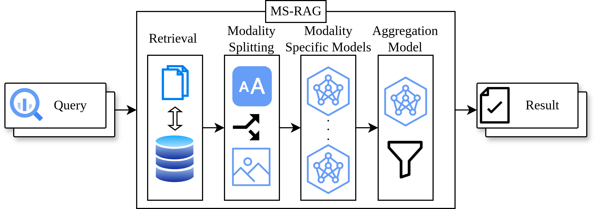

# MS-RAG: Modality Split Retrieval-Augmented Generation

MS-RAG (Modality Split RAG) is a framework for **multimodal Retrieval-Augmented Generation (RAG)** that separates **text** and **image** reasoning pipelines to improve accuracy when answering questions about scientific papers and other multimodal documents. 
Unlike standard Vision-Language Models (VLMs), which process text and images jointly, MS-RAG assigns **specialized models** to each modality and aggregates their outputs for final response generation.

> **Note**: This project has been **submitted to the HICSS 2025 Conference**. A finalized and fully cleaned-up code release will be coming soon.

---

## Features
- **Modality Split Architecture**: Separate retrieval and reasoning pipelines for text and image data.  
- **PDF Processing**: Uses PyMuPDF for text extraction and LayoutParser for figure/table detection.  
- **Multimodal Retrieval**: Embedding-based retrieval for both text and image data.  
- **Evaluation**: Performance assessed via cosine similarity, ROUGE scores, and manual review.  

---

## System Overview
1. **Text Pipeline**  
   - Extracts text with **PyMuPDF**  
   - Embeds with **Qwen2.5-VL-7B-Instruct**  
   - Retrieves context using FAISS  

2. **Image Pipeline**  
   - Extracts figures/tables with **LayoutParser**  
   - Processes with **Qwen2.5-VL-7B-Instruct**  
   - Retrieves image context via embeddings  

3. **Aggregator**  
   - Combines modality-specific outputs  
   - Produces the final, grounded response  

 <!-- replace with actual path -->

---

## Results
- MS-RAG improves **answer relevance** and reduces hallucination compared to baseline VLM-RAG.  
- Evaluated on **100 NeurIPS 2024 papers** with **120 multimodal QA pairs** (graphs, tables, diagrams).  
- Metrics used:  
  - Cosine similarity  
  - ROUGE-1, ROUGE-2, ROUGE-L  
  - Manual human evaluation  

---
